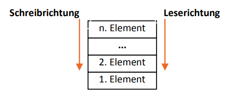
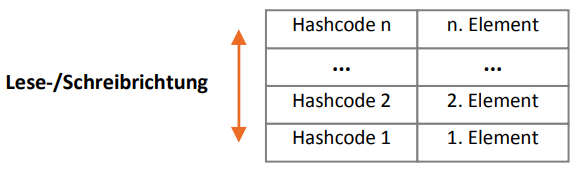

# Auflistungen (Collections)

+ Elemente können flexibler hinzugefügt und entfernt werden als bei Arrays
+ Es muss nicht die Größe (Anzahl Elemente) vorher festlegen
+ Für viele Operationen wird kein Index benötigt

Beispiele: ListBox, ComboBox, ListView, TreeView

## ArrayList

Auflistung welche Elemente vom Typ object aufnimmt

### Eigenschaften und Methoden von ArrayList
+ `Count`: Anzahl der Listenelemente
+ `Capacity`: Kapazität der Liste
+ `Add()`: Fügt der Liste ein neues Element hinzu (am Ende)
+ `Remove()`: Entfernt ein Element aus der Liste
+ `RemoveAt()`Entfernt ein Element aus der Liste mit angegebenem Index

## Warteschlange (Queue)
+ Arbeitet nach dem FIFO-Prinzip (**F**irst **I**n **F**irst **O**ut)
+ Neue Elemente können nur am Ende hinzugefügt werden
+ Entfernen von Elementen erfolgt immer am Anfang der Warteschlange

### Eigenschaften und Methoden von Queue
+ `Count`: Anzahl der Listenelemente
+ `Enqueue()`: Hinzufügen eines Elements
+ `Dequeue()`: Entfernen eines Elements

## Stapel (Stack)
+ Arbeitet nach dem LIFO-Prinzip (**L**ast **I**n **F**irst **O**ut)
+ Neue Elemente werden immer oben auf dem Stapel abgelegt und auf wieder entnommen
+ Elemente werden dadurch in der Reihenfolge umgekehrt

### Eigenschaften und Methoden von Stack
+ `Count`: Anzahl der Listenelemente
+ `Push()`: Legt ein Element auf den Stapel
+ `Pop()`: Entfernt das oberste Element des Stapels

## Hash-Tabelle (Hashtable)
+ Elemente werden mit Hilfe eines Schlüssel gespeichert und abgerufen
+  Der Schlüssel kann von beliebigem Datentyp sein ("Hallo", 123)
+  Hashcode selbst ist ein Integerwert
+  Es können Kollisionen auftreten
+  

### Eigenschaften und Methoden von Hashtable
+ `Count`: Anzahl der Listenelemente
+ `Add`: Fügt Element mit Hilfe eines Schlüssels hinzu
+ `GetHashCode`: ermittelt Hashcode